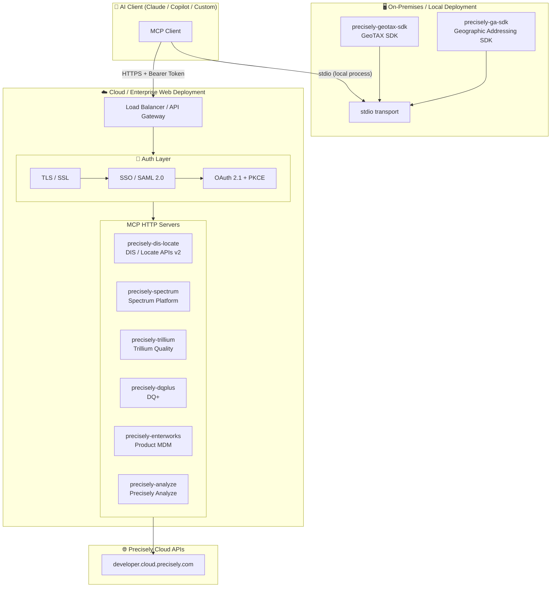

# Precisely MCP Servers — Architecture

---

## Deployment Architecture

MCP servers in this registry span two deployment patterns — **on-premises SDK** servers (running locally alongside the AI client) and **cloud/enterprise web servers** (secured with TLS, SSO, and OAuth 2.1).



> **On-Premises SDKs** (`ga-sdk`, `geotax-sdk`) run as local processes communicating over **stdio** — no network exposure, credentials stay on-device.
> **Web servers** expose an **HTTP/SSE** or **Streamable HTTP** endpoint, protected by TLS termination at the gateway, SSO for identity federation, and OAuth 2.1 with PKCE for token-based access.

---

## Claude Desktop — Multi-Server Configuration Example

Add multiple Precisely MCP servers to `%APPDATA%\Claude\claude_desktop_config.json`:

```json
{
  "mcpServers": {
    "precisely-dis-locate": {
      "command": "python",
      "args": ["-m", "mcp_servers"],
      "cwd": "C:\\path\\to\\dis-locate-apis-v2",
      "env": {
        "PRECISELY_API_KEY": "your_api_key",
        "PRECISELY_API_SECRET": "your_api_secret"
      }
    },
    "precisely-dqplus": {
      "command": "python",
      "args": ["-m", "mcp_servers"],
      "cwd": "C:\\path\\to\\dq-plus-mcp",
      "env": {
        "DQPLUS_API_ENDPOINT": "https://your-dqplus-instance/graphql",
        "DQPLUS_API_KEY": "your_api_key"
      }
    }
  }
}
```

Each product folder contains a ready-to-copy `claude_desktop_config.example.json`.

