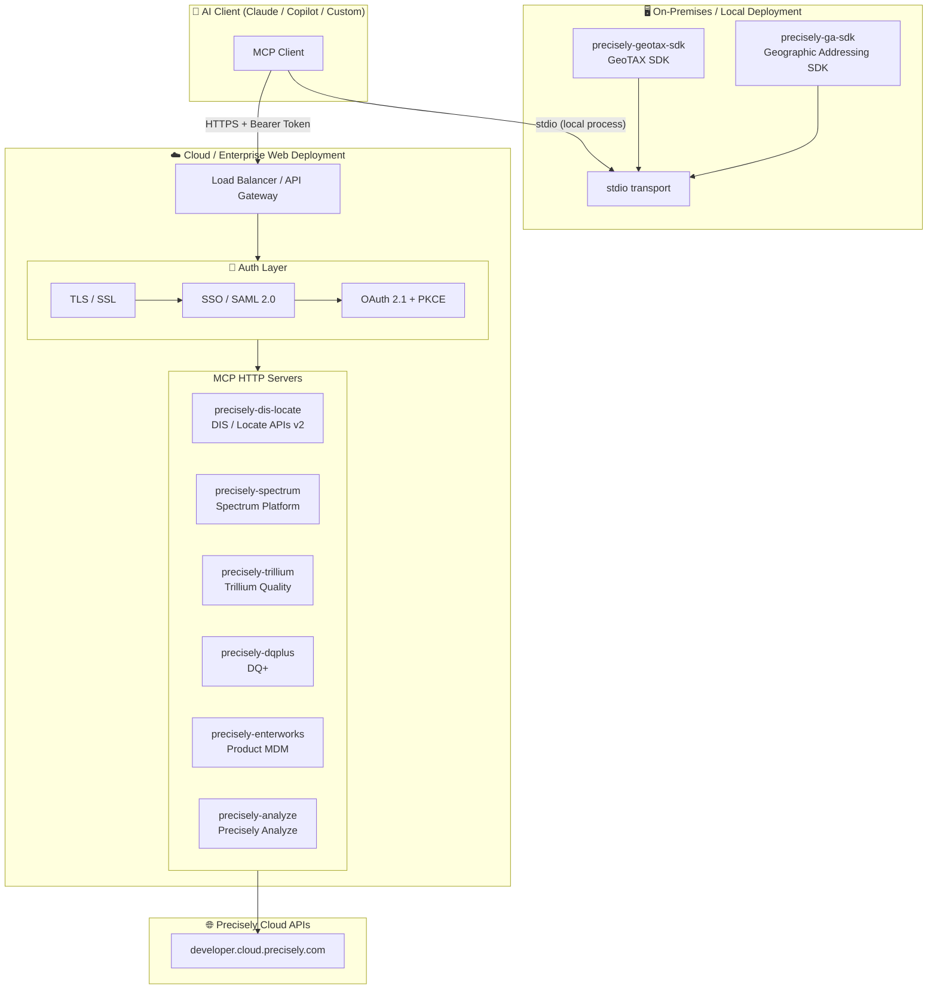

# Precisely MCP Servers

> **The Precisely MCP Registry** — a central hub for Model Context Protocol (MCP) servers across the Precisely product portfolio. Some products host their full server implementation here; others are documented here with configuration examples while their code lives in dedicated repositories.

---

## MCP Server Registry

| Server | Product | Tools | Transport | Server Location | Docs | Status |
|--------|---------|:-----:|-----------|-----------------|------|:------:|
| `precisely-dis-locate` | DIS / Locate APIs v2 | 68 | stdio, HTTP | This repo → [`dis-locate-apis-v2/`](dis-locate-apis-v2/) | [README](dis-locate-apis-v2/readme.md) | ✅ Active |
| `precisely-spectrum` | Spectrum Technology Platform | ~10 | stdio, HTTP | TBD | [README](core-spectrum/README.md) | 🔵 Beta |
| `precisely-trillium` | Trillium Quality | ~5 | stdio, HTTP | External repo | [README](core-trillium-quality/README.md) | 🔵 Beta |
| `precisely-dqplus` | DQ+ (Data Quality Plus) | ~5 | stdio, HTTP | External repo | [README](core-dq-plus/README.md) | 🔵 Beta |
| `precisely-enterworks` | Enterworks (Product MDM) | ~5 | stdio, HTTP | External repo | [README](core-enterworks/README.md) | 🔵 Beta |
| `precisely-analyze` | Precisely Analyze | ~5 | stdio, HTTP | External repo | [README](core-analyze/README.md) | 🔵 Beta |
| `precisely-ga-sdk` | Geographic Addressing SDK | ~5 | stdio | External repo | [README](core-ga-sdk/README.md) | 🔵 Beta |
| `precisely-geotax-sdk` | GeoTAX SDK | ~5 | stdio | External repo | [README](core-geotax-sdk/README.md) | 🔵 Beta |

**Status key:**
- ✅ **Active** — fully implemented, tested, and production-ready in this repo
- 🔵 **Beta** — folder and docs scaffolded; full implementation in progress or external
- 🔴 **Deprecated** — no longer maintained

---

## Deployment Architecture

MCP servers in this registry span two deployment patterns — **on-premises SDK** servers (running locally alongside the AI client) and **cloud/enterprise web servers** (secured with TLS, SSO, and OAuth 2.1).



> **On-Premises SDKs** (`ga-sdk`, `geotax-sdk`) run as local processes communicating over **stdio** — no network exposure, credentials stay on-device.
> **Web servers** expose an **HTTP/SSE** or **Streamable HTTP** endpoint, protected by TLS termination at the gateway, SSO for identity federation, and OAuth 2.1 with PKCE for token-based access.

---

## Quick Start

### Use an Active Server (DIS / Locate APIs v2)

```bash
cd dis-locate-apis-v2
pip install -r requirements.txt
```

Then follow [`dis-locate-apis-v2/readme.md`](dis-locate-apis-v2/readme.md) for full setup.

### Claude Desktop — Multi-Server Configuration Example

Add multiple Precisely MCP servers to `%APPDATA%\Claude\claude_desktop_config.json`:

```json
{
  "mcpServers": {
    "precisely-dis-locate": {
      "command": "python",
      "args": ["-m", "mcp_servers"],
      "cwd": "C:\\path\\to\\dis-locate-apis-v2",
      "env": {
        "PRECISELY_API_KEY": "your_api_key",
        "PRECISELY_API_SECRET": "your_api_secret"
      }
    },
    "precisely-dqplus": {
      "command": "python",
      "args": ["-m", "mcp_servers"],
      "cwd": "C:\\path\\to\\dq-plus-mcp",
      "env": {
        "DQPLUS_API_ENDPOINT": "https://your-dqplus-instance/graphql",
        "DQPLUS_API_KEY": "your_api_key"
      }
    }
  }
}
```

Each product folder contains a ready-to-copy `claude_desktop_config.example.json`.

---

## Repository Structure

```
precisely-mcp-servers/
│
├── README.md                        ← This file — MCP Registry
├── _specs/                          ← Planning & specification documents
│   └── mcp-registry-expansion.md
│
├── dis-locate-apis-v2/              ← ✅ HOSTED: DIS / Locate APIs (68 tools)
├── core-spectrum/                   ← 🔵 Beta: Spectrum Technology Platform
├── core-trillium-quality/           ← 🔵 Beta: Trillium Quality
├── core-dq-plus/                    ← 🔵 Beta: DQ+
├── core-enterworks/                 ← 🔵 Beta: Enterworks MDM
├── core-analyze/                    ← 🔵 Beta: Precisely Analyze
├── core-ga-sdk/                     ← 🔵 Beta: Geographic Addressing SDK
└── core-geotax-sdk/                 ← 🔵 Beta: GeoTAX SDK
```

---

## Authentication

Each product uses its own credentials. Refer to the individual product `README.md` for environment variable names and setup instructions. The DIS / Locate server requires:

- `PRECISELY_API_KEY`
- `PRECISELY_API_SECRET`

Get Precisely API credentials at [developer.cloud.precisely.com](https://developer.cloud.precisely.com/apis).

---

## Contributing / Adding a New Server

See [`_specs/mcp-registry-expansion.md`](_specs/mcp-registry-expansion.md) for the full registry expansion specification, including:

- Folder and naming conventions
- Standard `README.md` template for each product
- Implementation phases and open questions

---

## Support

- Precisely API docs: https://developer.cloud.precisely.com/apis
- Issues: Use this repository's [GitHub Issues](../../issues)

## License

See [`dis-locate-apis-v2/LICENSE`](dis-locate-apis-v2/LICENSE).
